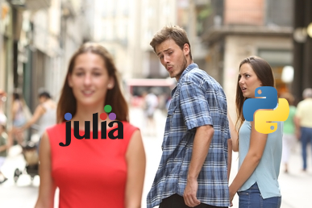

# Intro to Julia

2023-07-17



# Why is Julia great?

Why is Julia the best thing since sliced bread?
In this post, I'll argue why I think Julia is a great language to learn for beginners.

* It is a modern language with an interactive REPL
* It is easy to install on many platforms (Linux, Windows, OS-X)
* It has build in package manager
* It has excellent documentation
* It has a great community and eco system

In later posts, I plan to cover

* Structs (classes)
* Multiple dispatch
* Broadcasting
* Compilation
* Plotting
* Package development
* Applications like web-development

Let's get to it.

# The REPL

REPL is short for Read-Eval-Print-Loop.
It gives an interactive shell to work with the language.

This is common in interpreted languages like python, R, Ruby, Perl, but not as common in compiled languages as Rust, Go, C, Fortran.
Julia is a compiled language, but it feels a lot like an interpreted language.

The REPL has multiple modes:

* Julia mode where Julia code is evaluated
* Package mode, where you interact with the package manager
* Help mode for displaying help
* Shell mode for escaping to the operating system shell.

The Package mode is entered by typing "]" (right square bracket), help by typing "?" and shell by typing ";".
**You get back to the Julia mode by hitting backspace.**

My preferred way to start Julia for interactive use is this

```
julia -t auto,1 -O0 --project=.
```

This does the following:

* Start multi-threaded with one interactive thread
* Avoid optimization in the compiler (for better interactivity)
* Write a Project.toml file in the current directory to keep track of packages used in the current work. I always make a folder for a given task.

A nice quality-of-life feature of the REPL is that is recognizes and removes it's own prompt, so when you copy code from the internet, it just works.

# Installing Julia

On all supported platforms, you can just download a single file, unpack it and go.
No special setup is needed. This is great for just trying it out.
Note, that it to uninstall you need to remove more than just the unpacked files (on Linux everything under ~/.julia).

A better way is to us [juliaup](https://github.com/JuliaLang/juliaup) which will help you manage versions of Julia as they come out.
It is available in Windows Store and is installed by a one-liner on Linux and Mac.

Editor support in VS Code is good via the [julia plugin](https://www.julia-vscode.org/).

# Package Manager

In Julia the package manager is build-in, and that was one of the mile-stones for v 1.0 release.
Packages are found via the "general registry" which keeps track of publicly registered packages.
In recent releases, it will prompt you to install a package the first time you try to use it from the REPL.

Example:

```
julia> using Revise
 │ Package Revise not found, but a package named Revise is available from a registry. 
 │ Install package?
 │   (tmp) pkg> add Revise 
 └ (y/n/o) [y]: 

```

Packages can also be installed from the Package mode of the REPL or using the `Pkg.add` function from the Pkg package which is part of the Julia installation.

Note, that you should not include the ".jl" in the package name.

## How to find packages

The [general registry]() is a bit hard to navigate directly.
Usually including "jl" in searches will find useful packages.
Many packages are collected under GitHub organizations. 
That gives a nice feeling that it will be stable and supported.

Note, that Julia and packages use "semantic versioning". 
A version number below 1.0 indicates that the API is still under development and may change frequently.


# Documentation and community

The official Julia documentation is a pleasure to read: <https://docs.julialang.org/en/v1/>.

It is clear that the creators of the language have learned from the recent history of programming languages like Python, R, Ruby, Rust etc, and has take en best parts and avoided a lot of mistakes.
The REPL and in-build package manager are good examples of this.

The community is very friendly and helpful. 
The main forum is on Discourse: <https://discourse.julialang.org/>.
Questions here are usually answered very quickly.
See [here](https://julialang.org/community/) for a list of community resources.

Other free resources include:

* Recordings from past JuliaCon and other conferences on [YouTube](https://www.youtube.com/channel/UC9IuUwwE2xdjQUT_LMLONoA)
* [Julia Forem](https://forem.julialang.org/) Blog posts about Julia
* [Julia Bloggers](https://www.juliabloggers.com/) A blog aggregator
* [Julia Data Science](https://juliadatascience.io/) A full length book with emphasis on data science
* [Julia Academy](https://www.juliabloggers.com/) Online courses.

A lot of good advice is collected here: https://m3g.github.io/JuliaNotes.jl/stable/.
Some very experienced people are sharing best practices in this document: https://gdalle.github.io/ModernJuliaWorkflows/.

Lots of tutorials online.

# When is Julia v2.0?

Hopefully never!

The Julia community worked about 6 years on the details of the language before version 1.0 came out in 2018. 
The ambition is that no breaking changes are needed to the language, and thus we can keep working in the 1.x series.
The current version is 1.9, and each version has brought significant improvements.

# Conclusions

I hope to have conveyed some of my own enthusiasm for this great language, and helped others get started.
