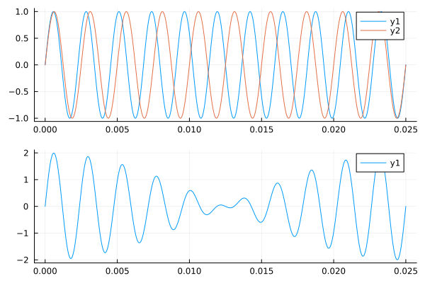
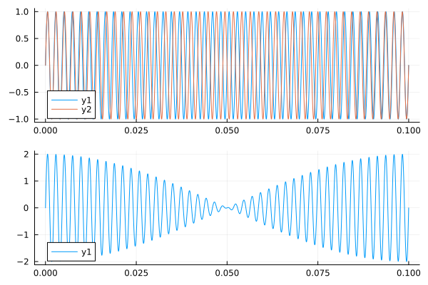

# Julia Tunings
TP, 2024-06-16

# Conclusions

* plot(plot(sound.([t(440) t(400)]), 0, 1/40), plot(sound([t(440) t(400)]), 0,1/40), layout=(2,1))
* save_wav("440hz.wav", t(440))
* play(t(440)) # This works well

WAV.jl writes Float32 no matter what it gets as input.
I have not figured out to use SampledSignals.

TODO: I can do a bit better by also making Sound a struct.

# Today's principles

* Use [c e g] for poly-phony (sounds)
* Use [a, b, c] for sequence of tones (melody)
* Use DataFrame(time, voice1, voice2, ...) for score

# Tuning system

Defined by:

* Number of tones per octave (pitch classes)
* Mapping of tones to pich-classes

# Tone

``` julia
struct Tone
    frequency::Float64
    phase::Float64
    duration::Float64
    volume::Float64
    func::Function
end

t(f, p=0, d=1, v=1) = Tone(f, p, d, v, x -> v*sin(2pi*f*x + p))

sound(t::Tone) = t.func
function sound(m::Matrix{Tone})
    x -> sum(map(t -> t.func(x), m))
end

```

# Plotting

``` julia
using Plots
plot(plot(sound.([t(440) t(400)]), 0, 1/40), plot(sound([t(440) t(400)]), 0,1/40), layout=(2,1))
savefig("beat_440-400.png")
```




## Beat tones

The beat tone has the frequency of the difference between the 2 tones:


``` julia
using Plots
plot(plot(sound.([t(440) t(430)]), 0, 1/10), plot(sound([t(440) t(430)]), 0,1/10), layout=(2,1))
savefig("beat_440-430.png")

```



# Render to soundfile

## Failed: SampledSignals

Try using https://github.com/JuliaAudio/LibSndFile.jl
I can not make SampledSignals work

``` julia
using FileIO: save
import LibSndFile
using SampledSignals: SampleBuf

function render(t::Tone; samplerate=44100)
    x = 0:1/samplerate:(t.duration-1/samplerate)
    y = convert.(Float32,t.func.(x))
    SampleBuf(y, samplerate)
end
render(t::Tone, file; samplerate=44100) = save(file, render(t;samplerate))
```

Float64 sounds terrible and Float32 is too low and too long.

## Works: WAV

``` julia
using WAV
function render_wav(t::Tone, file; samplerate=44100)
    x = 0:1/samplerate:(t.duration-1/samplerate)
    y = t.func.(x)
    wavwrite(y, file, Fs=samplerate)
end

```

# Consolidate Rendering to file


``` julia
using SampledSignals

function sample(t::Tone; samplerate=44100, type = Float64)
    x = 0:1/samplerate:prevfloat(t.duration)
    y = convert.(type, t.func.(x))
    (x,y)
end

##  I can still not get SampledSignals to work propperly
function render_buf(t::Tone; samplerate=44100, type = Float64)
    (_,y) = sample(t; samplerate, type)
    SampleBuf(y, samplerate)
end

## WAV works fine
function save_wav(file, t::Tone; samplerate=44100, type=Float64)
    (_,y) = sample(t; samplerate, type)
    wavwrite(y, file, Fs=samplerate)
end

```

## Test file sizes

It looks like WAV is always Float32

``` julia
save_wav("440hz-16.wav", t(440), type=Float16)
save_wav("440hz-32.wav", t(440), type=Float32)
save_wav("440hz-64.wav", t(440), type=Float64)


julia> filesize.(["440hz-16.wav", "440hz-32.wav", "440hz-64.wav"])
# 3-element Vector{Int64}:
# 176468
# 176468
# 176468
176468/44100
# 4.001541950113379 # So 4 bytes per sample = Float32
```

# Play a tone

```julia
function play(t::Tone)
    tf = tempname()
    save_wav(tf, t)
    wavplay(tf)
end
```
