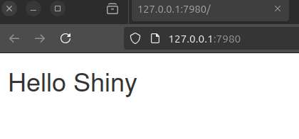
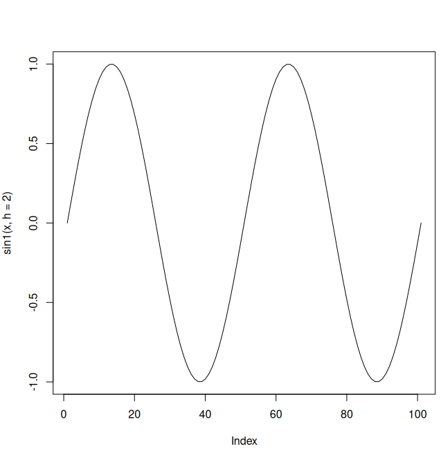
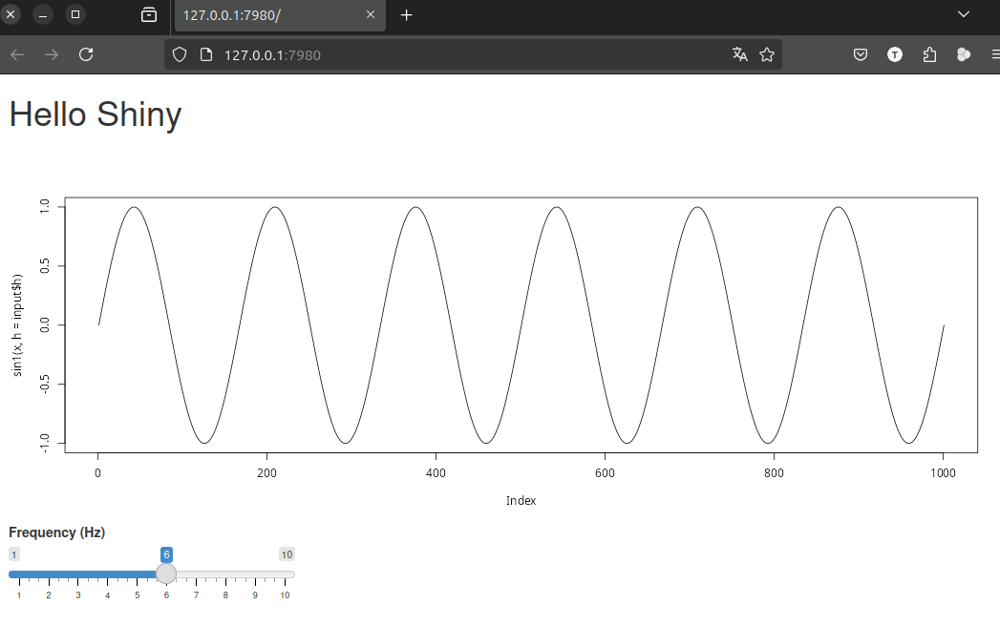
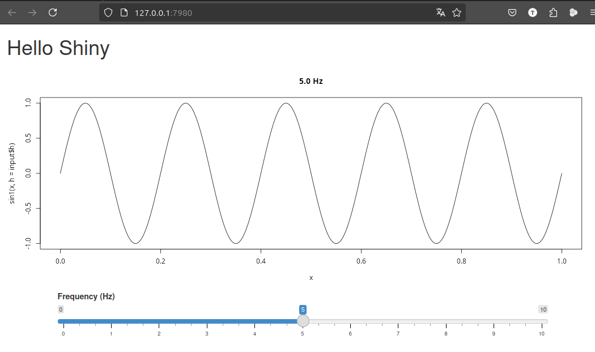

# Live coding a Shiny app
TP, 2025-02-03

# Hello World
Let's start by saying hello.

``` r
library(shiny)
ui <- fluidPage(h1("Hello Shiny"))

server <- function(input, output, session){
}

app <- shinyApp(ui, server)
runApp(app)

```



# Add a plot
Now add a static plot

``` r
library(shiny)
ui <- fluidPage(h1("Hello Shiny"),
                plotOutput("p1")
                )

server <- function(input, output, session){
    output$p1 <- renderPlot(plot(sin))
}

app <- shinyApp(ui, server)
runApp(app)

```

# Rescale sin function
I want an oscilator with the frequency as parameter.

``` r
sin1 <- function(x, h=1) sin(2*pi*x*h)

x <- seq(0,1,0.01)
plot(sin1(x, h=2), type = "l")
                             
```



# Add slider

``` r
library(shiny)

sin1 <- function(x, h=1) sin(2*pi*x*h)
x <- seq(0,1,0.001)

ui <- fluidPage(h1("Hello Shiny"),
                plotOutput("p1"),
                fluidRow(sliderInput("h", min=1, max=10, value=1, label="Frequency (Hz)"))
                )

server <- function(input, output, session){
    output$p1 <- renderPlot(plot(sin1(x, h=input$h), type="l"))
}

app <- shinyApp(ui, server)
runApp(app)

```



# Extending the slider

Make the slider wider and more detailed.

``` r
library(shiny)

sin1 <- function(x, h=1) sin(2*pi*x*h)
x <- seq(0,1,0.001)

ui <- fluidPage(h1("Hello Shiny"),
                plotOutput("p1"),
                fluidRow(column(sliderInput("h", min=0, max=10, value=1, label="Frequency (Hz)", width="100%", step=0.1), offset=1, width=10))
                )

server <- function(input, output, session){
    output$p1 <- renderPlot(plot(x,sin1(x, h=input$h), type="l", main = sprintf("%.1f Hz", input$h)))
}

app <- shinyApp(ui, server)
runApp(app)

```


