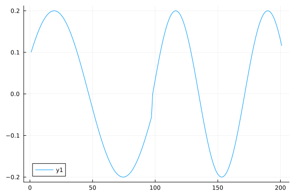

# Making sound in CSound
TP 2025-08-24

# Objective
How does CSound handle the transition between tones?

# Reading
According to the manual, it does not, and you need to apply an envelope:https://csound.com/get-started.html

# Running CSound
https://csound.com/docs/manual/Using.html

The AI says:

To get sound from Csound, write a Csound orchestra and score in a .csd file that uses an audio output opcode like out or out2 to send audio signals to the DAC (digital-to-analog converter) on your computer's sound card. Then, use a Csound frontend to execute the .csd file, which will process the code and play the resulting sound in real-time through your speakers

# Example code:
From To get sound from Csound, write a Csound orchestra and score in a .csd file that uses an audio output opcode like out or out2 to send audio signals to the DAC (digital-to-analog converter) on your computer's sound card. Then, use a Csound frontend to execute the .csd file, which will process the code and play the resulting sound in real-time through your speakers
``` csound
<CsoundSynthesizer>
<CsOptions>
-o dac
</CsOptions>
<CsInstruments>

sr = 44100
ksmps = 64
nchnls = 2
0dbfs = 1

instr Hello
  aSine = poscil:a(0.2,400)
  outall(aSine)
endin

</CsInstruments>
<CsScore>
i "Hello" 0 2
</CsScore>
</CsoundSynthesizer>
```

Running it:

```
csound sin1.csd 
```

Adding an other tone:

``` csound
<CsoundSynthesizer>
<CsOptions>
-o dac
</CsOptions>
<CsInstruments>

sr = 44100
ksmps = 64
nchnls = 2
0dbfs = 1

instr Hello
  aSine = poscil:a(0.2,400)
  outall(aSine)
endin

instr Hello2
  aSine = poscil:a(0.2,600)
  outall(aSine)
endin

</CsInstruments>
<CsScore>
i "Hello" 0 2
i "Hello2" 2 4
</CsScore>
</CsoundSynthesizer>

```

Output

```
p@ace7900:~/github/tp2750/Blog/en/2025/2025-08-24_Csound$ csound sin2.csd 
UnifiedCSD:  sin2.csd
instr Hello uses instrument number 1
instr Hello2 uses instrument number 2
Elapsed time at end of orchestra compile: real: 0.001s, CPU: 0.001s
sorting score ...
	... done
Elapsed time at end of score sort: real: 0.001s, CPU: 0.001s
--Csound version 6.18 (double samples) 2024-04-07
[commit: none]
libsndfile-1.2.2
graphics suppressed, ascii substituted
sr = 44100.0, kr = 689.062, ksmps = 64
0dBFS level = 1.0, A4 tuning = 440.0
orch now loaded
audio buffered in 256 sample-frame blocks
ALSA output: total buffer size: 1024, period size: 256
writing 512 sample blks of 64-bit floats to dac
SECTION 1:
new alloc for instr Hello:
B  0.000 ..  2.000 T  2.000 TT  2.000 M:  0.20000  0.20000
new alloc for instr Hello2:
B  2.000 ..  6.000 T  5.999 TT  5.999 M:  0.19999  0.19999
Score finished in csoundPerform().
inactive allocs returned to freespace
end of score.		   overall amps:  0.20000  0.20000
	   overall samples out of range:        0        0
0 errors in performance
Elapsed time at end of performance: real: 5.987s, CPU: 0.088s
1034 512 sample blks of 64-bit floats written to dac
```

How do I get the sound as a function to plot?

Writing to WAV file:

``` csound
<CsoundSynthesizer>
<CsOptions>
-o "sin3.wav"
</CsOptions>
<CsInstruments>

sr = 44100
ksmps = 64
nchnls = 2
0dbfs = 1

instr Hello
  aSine = poscil:a(0.2,400)
  outall(aSine)
endin

instr Hello2
  aSine = poscil:a(0.2,600)
  outall(aSine)
endin

</CsInstruments>
<CsScore>
i "Hello" 0 1
i "Hello2" 1 2
</CsScore>
</CsoundSynthesizer>

```

Now plot a wav-file

``` julia
using WAV
s3 = wavread("sin3.wav")
using Plots
plot(s3[1][44000:44200])
```



This looks familiar.

