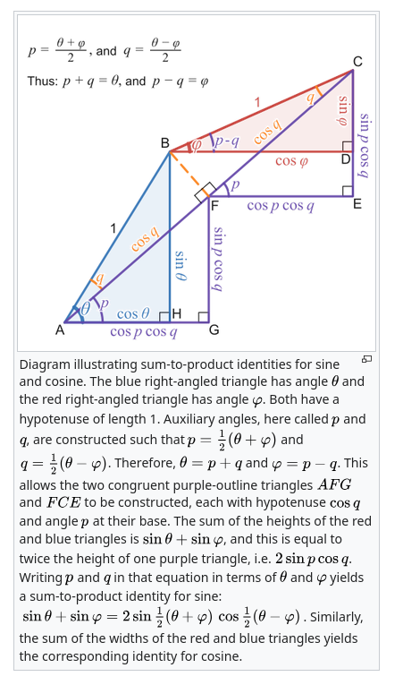

# Guitar tuning
TP 2025-09-13

# Conclusions

* When tuning a guitar using beat-tones, we are applying the "sum-to-product identity".

# Background

One way to tune a guitar is by using the "overtones".
This is done by gently touching the strings over the 5th and 3rd fret.
If the two strings are sligtly out of tune, a "beat tone" is head.
By tuning one string until the beat tone is gone, the two strings are perfectly tuned.
This can be easier to hear for some people thatn comparing the full tones between strings, as the timbre of the strings differs.

# Explanation

This is a consequence of the "sum of sines identity":[^1] 

$$\sin(a) + \sin(b) = 2 \sin(\frac{a + b}{2}) \cos(\frac{a - b}{2})$$

Note, $\cos$ is an even function, so $\cos(-a) = \cos(a)$.

If `a` is close to `b`, then this says that playing tones at frequencies `a` and `b` together will sound like a single tone at the average frequency $(a+b)(2$ modulated by a slow oscillation with a frequency of half the difference between the two tones.

This is what we hear, when tuning the guitar: when the tones are different, but close to gether, we hear a beat-tone, where the beating has the frequency of half the difference between the two tones.

[wikipedia](https://en.wikipedia.org/wiki/List_of_trigonometric_identities#Sum-to-product_identities) has a nice geometric [proof of this identity](https://en.wikipedia.org/wiki/List_of_trigonometric_identities#/media/File:Diagram_illustrating_sum_to_product_identities_for_sine_and_cosine.svg)

[^1] https://en.wikipedia.org/wiki/List_of_trigonometric_identities#Sum-to-product_identities, https://personal.math.ubc.ca/~cbm/aands/page_72.htm
