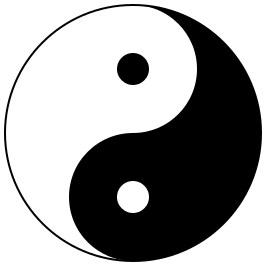
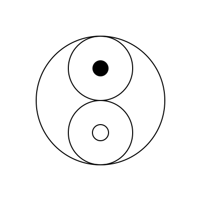
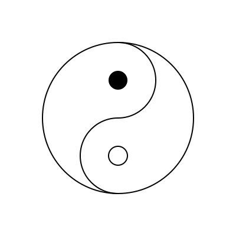

# Drawng Yin-Yang in Luxor
TP 2025-21-22

I want to draw the Yin-Yang symbol using [Luxor.jl](https://github.com/JuliaGraphics/Luxor.jl).

The final result looks like this:



This was produced like this:

``` julia
using Luxor
R = 128
@png begin
    move(Point(0,-R))                            # start at top
    arc(Point(0,0), R, -pi/2, pi/2, :path)       # right side arc to bottom
    arc(Point(0,R/2), R/2, pi/2, -pi/2, :path)   # small arc up
    carc(Point(0,-R/2), R/2,  pi/2, -pi/2,:path) # small arc counterclockwise
    fillpath()
    circle(Point(0,0), R, action=:stroke)        # outline circle
    circle(Point(0,-R/2), R/8, action=:fill)     # white fish eye
    sethue("white")
    circle(Point(0,R/2), R/8, action=:fill)      # black fish eye
end 2R+10 2R+10 "ying-yang.png"
```

The radii of the 3 circles used to draw the Yin-Yang symbol are 1:2:8 according to this paper: [Taiji variations: Yin and Yang in multiple dimensions](https://www.researchgate.net/publication/262332580_Chaos_and_Graphics_Taiji_variations_Yin_and_Yang_in_multiple_dimensions).

Here's how it works:

* Start at the top of the large circle (note that y coordinates go down in Luxor, so the top point is (0,-R))
* Do a large arc down to the bottom. Arcs n Luxor are clockwise and start at (R,0). Angles are measured in radians.
* Continue with a semi-circle of half the radius, centered at R/2.
* Contine with a counter-clockwise semi-circle back up to the top (radius R/2, center -R/2)
* Fill this path to color it black. Note the `:path` option in the drawing functions this far.
* Add the surrounding circle of radius R (this is drawn directly with `:stroke`
* Add the "eye" of the "white fish" as a filled circle of radius R/8.
* Change to white foreground color and add the "eye" of the black "fish".

I would have liked the eye of the black fish to be transparent, but I was not able to do this.

I learned a few things:

* y coordinates go down in Luxor, so the top point is (0,-R)
* Arcs n Luxor are clockwise and start at (R,0). Angles are measured in radians.
* In order to use `fillpath()` I need to create a closed "path".


I started with this basic outline:

``` julia
# This is the basic outline
@png begin
circle(Point(0,0), 128, action=:stroke)  # large circle
circle(Point(0,64), 64, action=:stroke)  # lower circle 
circle(Point(0,64), 16, action=:stroke)  # white eye
circle(Point(0,-64), 64, action=:stroke) # upper circle
circle(Point(0,-64), 16, action=:fill)   # black eye
end 400 400 "circles.png"
```



This was refined with arcs:

``` julia
# Refined  Outline 
@png begin
circle(Point(0,0), 128, action=:stroke)             # large circle
arc(Point(0,64), 64, pi/2, 3pi/2, action=:stroke)   # lower arc
circle(Point(0,64), 16, action=:stroke)             # white yey
arc(Point(0,-64), 64,  3pi/2, pi/2,action=:stroke)  # upper arc
circle(Point(0,-64), 16, action=:fill)              # black eye
end 400 400 "outline.png"
```



But I cound not just "point" at the black fish and say "fill".
I needed to create the black "fish" in a single path to fill it.

